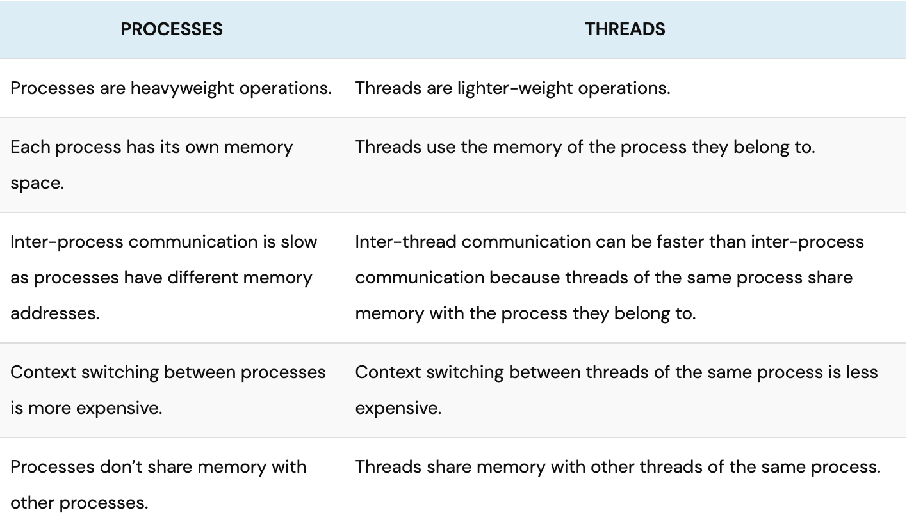

<h1>dining philosopher problem</h1>

  
The Dining Philosophers problem is a classic issue that demonstrates synchronization problems in a multi-threaded environment. It is often used in concurrent algorithm design to illustrate synchronization challenges and the techniques utilized to overcome them
    
  <h1>Problem statement</h1>
  <tr/>
  In this assignment, there is a scenario involving philosophers sitting at a round table with a bowl of spaghetti in the center. The philosophers follow a cycle of eating, thinking, and sleeping. They cannot perform multiple actions simultaneously - while eating, they can't think or sleep; while thinking, they can't eat or sleep; and while sleeping, they can't eat or think. There are as many forks as there are philosophers on the table, and each philosopher takes the forks on their right and left to eat with both hands. After finishing their meal, they put the forks back and start sleeping, then wake up to begin thinking again. The simulation continues until a philosopher dies of starvation. The goal is to ensure that all philosophers can eat and avoid starvation, even though they don't communicate with each other and are unaware of each other's state or impending death. The objective is for philosophers to survive and not perish.
  

  

  
  
  

  <h1>Solution</h1>
  <tr/>
  To address this problem, we may consider each chopstick as a shared item protected by a mutex lock . Each philosopher, before he can eat, locks his left chopstick and locks his right chopstick. If the acquisitions of both locks are successful, this philosopher now owns two locks (hence two chopsticks), and can eat.

 
<h1>threads vs prosses</h1><tr/>

